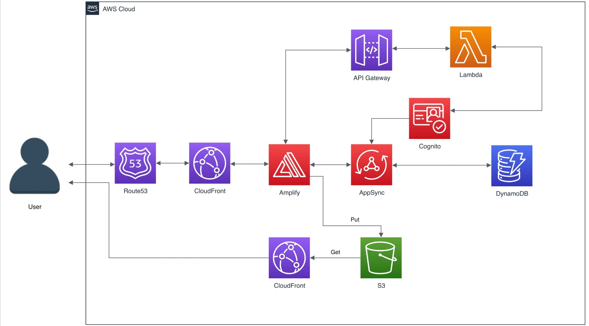

# COMP5322 Project

This is the COMP5322 Internet Computing and Applications Project. We proposed animal adoption platform and simple Admin Portal. The Web app is builded by Next.js + TailwindCSS + AWS Amplify.

## Description
The problem of animal abandon is serious in Hong Kong. Some of the reasons are finding that it is difficult to take care of a pet, increasing medical expenses due to age-related health issues and changing life situations, like getting divorced, having a baby, etc. 

In view of this worrying issue, we propose to build an animal adoption platform. It aims to look for kind people to provide a new and happy home to these abandoned animals and provide an online pet shop for users to purchase what they need. Therefore, a cloud-based platform and admin portal are proposed for general user and admin user access respectively.  On the platform, it allows the user to view the information of animals pending for adoption and make adoption requests if they want to. Users can check the status of requests too. In the online pet shop, it provides different pet necessities for customers to choose. After customers order the products, they can keep track of the status of the transaction through the platform. On the other hand, admin users perform their job in the admin portal. They can manage the platform by Create, Read, Update and Delete (CRUD) functions, regarding the details of adoption, pet shop and handling of adoption requests as well as the order of pet products.

System Demo Video: [Click Here (Youtube Video)](https://youtu.be/UutvLuqKuJA)

## System Architecture
